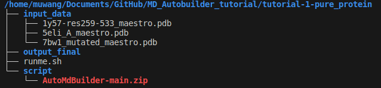
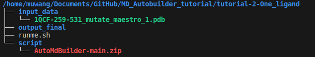
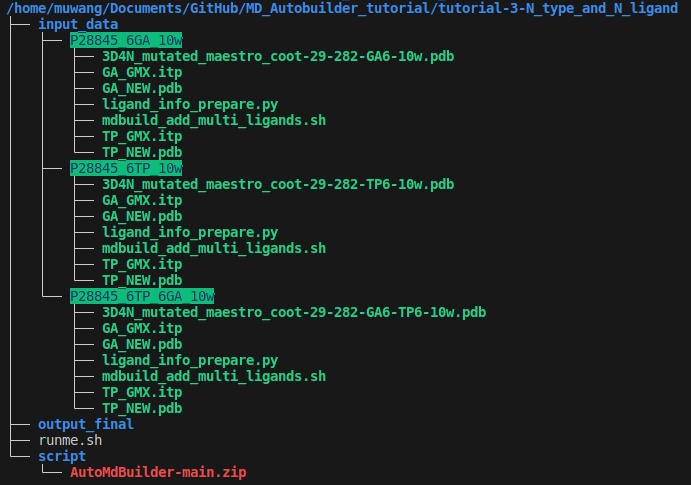

# MD_Autobuilder_tutorial

Quick start for building MD systems, especially for the 'Swimming' strategy.

## Environment preparation

### conda

```bash

# 0. create a new environment with name 'PFleet' by enviroment.yml
conda env create -f environment.yml
# 1. create a new environment with name acpype
conda create -n acpype --channel conda-forge ambertools openbabel
conda install -c conda-forge acpype

# activate the virtual environment
conda activate PFleet
# deactivate the virtual environment
# conda deactivate 

# environment 'acpype' will be called automatically when running building scripts 

```

## Go through tutorial

MD_Autobuilder is a tool of MD system building for the 'Swimming' strategy, and also capable of normal basic situations.

1. pure protein (SUPPORTED)
2. protein + ONE type ligand (number of this type is ONE) + in-situ (ligand's coordinates already set up ) (SUPPORTED)
3. protein + N type(s) ligand(number of this type is N) + 'Swimming' (random atom position initialized) (SUPPORTED)
4. protein + N type(s) ligand (number of this type is N) + in-situ (DEVELOPING)

### How to start?

```bash
cd tutorial-1-pure_protein
source runme.sh

cd tutorial-2-One_ligand
source runme.sh

cd tutorial-3-N_type_and_N_ligand
source runme.sh

```

### Structure of tutorial

For situations 1 and 2, put pure protein.pdb or protein-ligand-complex.pdb to 'input_data'. For situation 3, put directories of serval cases to  'input_data'. Each directory contains protein-ligand-complex.pdb, ligands' itp and pdb, and two scripts for ligand temporary files generation.

for pure protein:



for protein + ONE type ligand (number of this type is ONE) + in-situ:



for protein + N type ligand(number of this type is N) + 'Swimming':



## For more information

Please check the repository [AutoMdBuilder](https://github.com/GiantFurosemide/AutoMdBuilder) for more details on MD system building.
